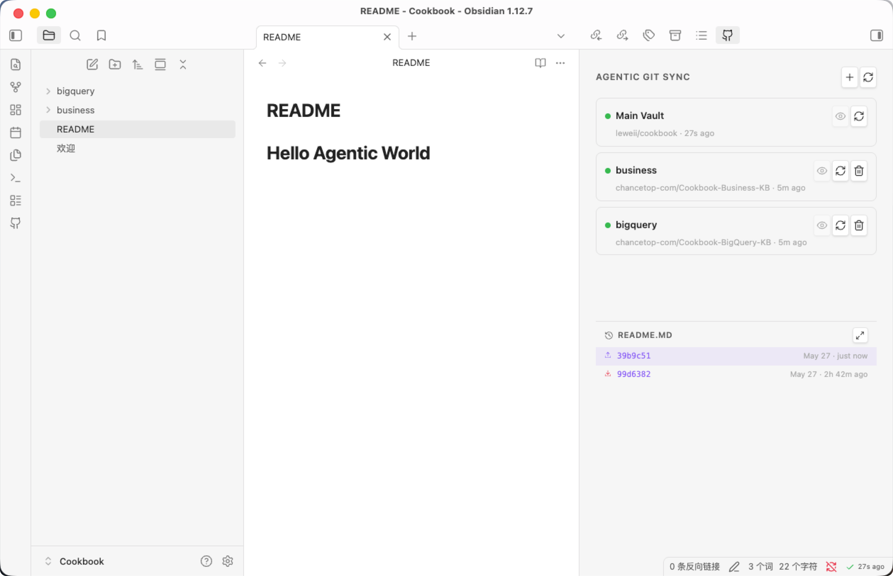
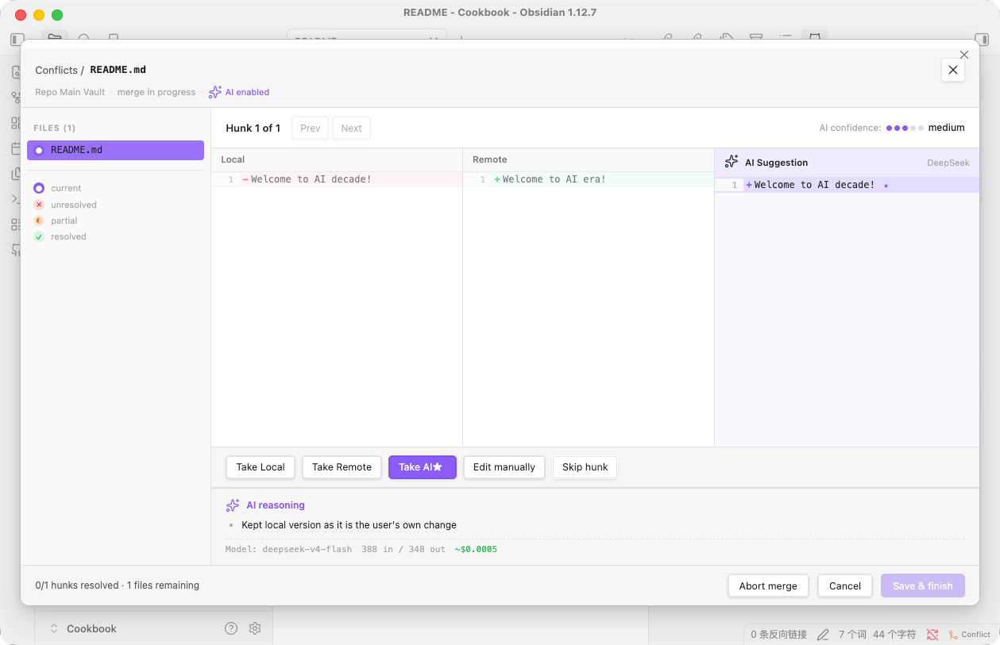
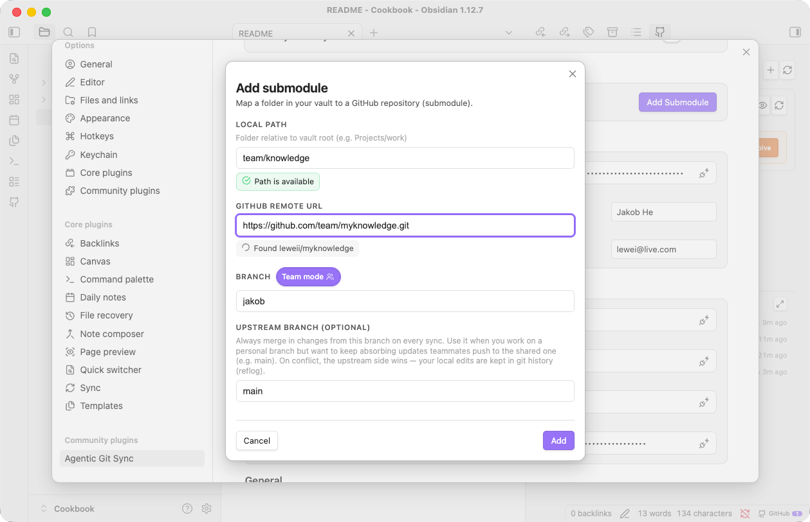
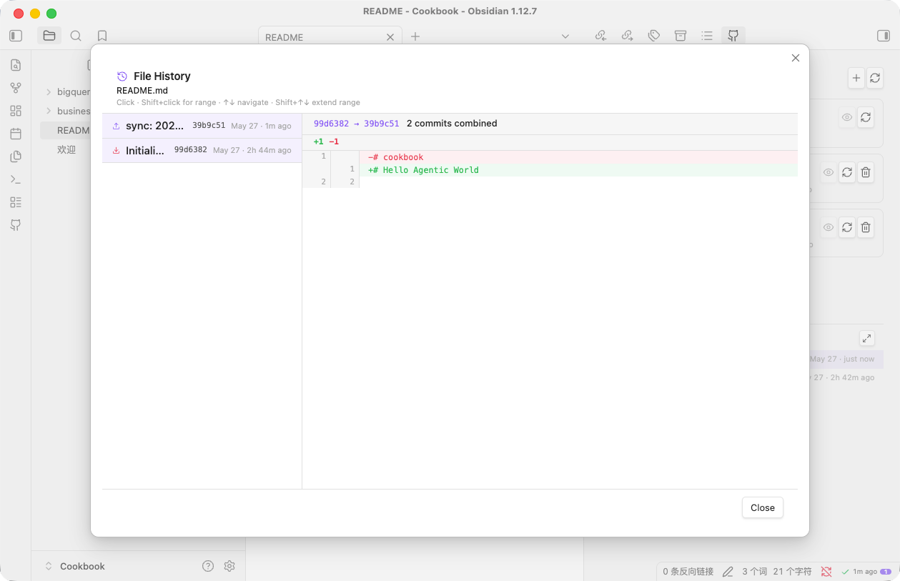

# Agentic Git Sync

[English](./README.md) | [简体中文](./README.zh-CN.md) | [繁體中文](./README.zh-TW.md) | [日本語](./README.ja.md)

为不懂 git 的 Obsidian 用户做的 GitHub 双向同步插件。核心是三件事。

## 核心特性

### AI Agent 处理 Git 技术细节

把繁琐的 Git 操作全权交给 AI。

- **AI 冲突解决** — 本地与远端分叉时自动尝试合并，仅在无法判定时弹出可视化对话框。打开后是 Local / Remote / AI Suggestion 三栏视图，附 AI 置信度评级与模型选择该侧的推理依据。
- **Git 操作诊断** — 不是 fast forward？需要 git merge before push？这些 git 使用规范你都不需要了解，Agentic 驾驭一切。
- **AI 起草 commit message** — DeepSeek 或 Gemini 读 diff 后生成语义化提交信息，可在提交前编辑。
- **空 repo 自动初始化** — 粘 URL 即可，插件静默处理初始 commit 与首推。

### 适配个人数据同步 / 团队协作的场景

既保护了个人隐私，又能高效适配团队协作，相互独立，互不干扰。

- 个人的知识永远保持私有。
- 与团队共享的知识通过 submodule 维护。
- 用户友好的冲突管理界面。
- 简单易懂的个人分支与团队主分支管理机制。

### 无感双向同步

后台调度器周期性 pull 与 push，用户照常写笔记。Token 与本机状态留在 `.obsidian/`（不入 repo），远端配置与 submodule 列表写在 `.github-sync.json` 里随仓库走，换机器 clone 后配置自动恢复。

## 安装

**社区插件**：设置 → 第三方插件 → 浏览 → 搜索 *Agentic Git Sync* → 安装 → 启用。

**手动安装**：从 [最新 release](https://github.com/leweii/agentic-git-sync/releases/latest) 下载 `main.js`、`manifest.json`、`styles.css`，放到 `<vault>/.obsidian/plugins/agentic-git-sync/`，重启 Obsidian 并启用。

## 快速开始

设置 → Agentic Git Sync → **运行配置向导**：

1. 粘贴 GitHub Personal Access Token（点击 `?` 图标会打开 GitHub Token 创建页）。Classic 需要 `repo` 权限；Fine-grained 需要 **Contents: read & write**。
2. 粘贴主仓库的 HTTPS URL，插件会自动处理初始 commit 与首次 push。
3. （可选）在面板中按文件夹添加 submodule。

## 数据安全

**密钥永不离开设备。** Token 存在 `<vault>/.obsidian/plugins/agentic-git-sync/data.json`，仅本机持有。提交到仓库的 `.github-sync.json` 在 schema 上就没有 token 字段，凭据无法被写入 commit。

## Git 历史

不离开 Obsidian 即可浏览任意文件的提交历史。点击某次提交（或 shift-点击选范围）查看内联 diff；commit message 就是同步时由 AI 生成的语义化信息。

## 许可证

[MIT](./LICENSE)
